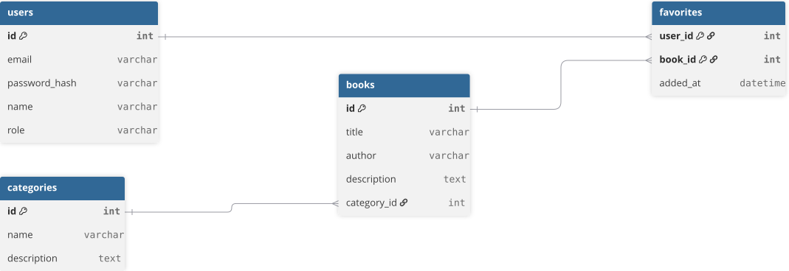

# Технічне завдання: Електронна бібліотека «BookSpace»
**Автор:** Гнатюк Владислав, група 5-ІПБ

## Крок 1. Тема проєкту
* **Назва застосунку:** Електронна бібліотека «BookSpace»
* **Призначення:** Вебзастосунок для каталогізації, пошуку та збереження електронних книг і навчальних матеріалів.
* **Цільова аудиторія:** Студенти, викладачі та книголюби, які шукають структурований доступ до літератури.

## Крок 2. Ролі користувачів
| Роль | Мета використання | Що доступно |
| :--- | :--- | :--- |
| **Гість** | Пошук та перегляд матеріалів без реєстрації | Перегляд каталогу, пошук, фільтрація, перегляд картки книги |
| **Користувач** | Збереження корисних матеріалів для швидкого доступу | Усе, що й гостю, плюс: вхід, додавання книг у «Вибране», перегляд особистого кабінету |
| **Адміністратор** | Керування контентом бібліотеки та базою користувачів | Усе, що й користувачу, плюс: додавання, редагування, видалення книг і категорій |

## Крок 3. Функційні вимоги
| № | Вимога | Роль | Пріоритет |
| :--- | :--- | :--- | :--- |
| 1 | Користувач може переглядати загальний каталог книг | Гість, Користувач | Обов'язкова |
| 2 | Користувач може шукати книгу за частковим збігом назви | Гість, Користувач | Обов'язкова |
| 3 | Користувач може фільтрувати книги за обраною категорією | Гість, Користувач | Обов'язкова |
| 4 | Користувач може зареєструвати новий обліковий запис | Гість | Обов'язкова |
| 5 | Користувач може авторизуватися в системі | Користувач, Адміністратор | Обов'язкова |
| 6 | Користувач може додати книгу до списку збережених (вибраного) | Користувач | Обов'язкова |
| 7 | Користувач може переглядати перелік збережених книг у кабінеті | Користувач | Обов'язкова |
| 8 | Користувач може видалити книгу зі свого списку вибраного | Користувач | Бажана |
| 9 | Адміністратор може створити новий запис про книгу через форму | Адміністратор | Обов'язкова |
| 10 | Адміністратор може видалити книгу з бази даних | Адміністратор | Обов'язкова |

**Нефункційні вимоги:**

| Категорія | Вимога |
| :--- | :--- |
| Продуктивність | Сторінка переліку книг відкривається та завантажує дані не довше ніж за 2 секунди. |
| Безпека | Паролі користувачів зберігаються в базі даних виключно у вигляді хешів (bcrypt). |
| Адаптивність | Інтерфейс коректно відображається та функціонує за ширини вікна браузера від 360 px. |

## Крок 4. Карта сайту
| Розділ / сторінка | Доступ | Захищений маршрут |
| :--- | :--- | :--- |
| Головна (`/`) | Гість, Користувач, Адміністратор | ні |
| Каталог книг (`/books`) | Гість, Користувач, Адміністратор | ні |
| Картка книги (`/books/:id`) | Гість, Користувач, Адміністратор | ні |
| Вхід / Реєстрація (`/login`) | Гість | ні |
| Особистий кабінет (`/profile`) | Користувач, Адміністратор | так |
| Додавання книги (`/admin`) | Адміністратор | так |

* **Сценарій гостя:** Відкриває каталог книг → фільтрує видання за категорією → відкриває картку обраної книги → натискає «Додати у вибране» → система перенаправляє на сторінку реєстрації.
* **Сценарій зареєстрованого користувача:** Авторизується → відкриває каталог → знаходить книгу через пошук → додає книгу у вибране → переходить в особистий кабінет для перевірки списку.

## Крок 5. Сутності та зв'язки
| Сутність | Основні атрибути | Первинний ключ |
| :--- | :--- | :--- |
| `users` | `email`, `password_hash`, `role`, `name` | `id` |
| `categories` | `name`, `description` | `id` |
| `books` | `title`, `author`, `description`, `category_id` | `id` |
| `favorites` | `user_id`, `book_id`, `added_at` | `user_id, book_id` |

| Зв'язок | Тип | Де зовнішній ключ |
| :--- | :--- | :--- |
| `categories` - `books` | 1:N (один до багатьох) | `category_id` у таблиці `books` |
| `users` - `books` | M:N (багато до багатьох) | `user_id` та `book_id` у таблиці `favorites` |

Схема бази даних (файл `docs/Untitled.svg`):

## Крок 6. Обґрунтування стеку
| Рівень | Технологія | Чому доречна саме тут |
| :--- | :--- | :--- |
| Клієнт | React | Реалізація живого пошуку та фільтрації без перезавантаження сторінки. |
| Стилі | SCSS + БЕМ | Створення незалежних компонентів та зручна темізація інтерфейсу. |
| Сервер | PHP | Швидка розробка REST API, обробка форм та безпечне керування сесіями. |
| База даних | MySQL | Надійне збереження зв'язків між сутностями та швидка вибірка (JOIN). |
| Розміщення | вебхостинг | Забезпечення доступу до застосунку в мережі Інтернет. |